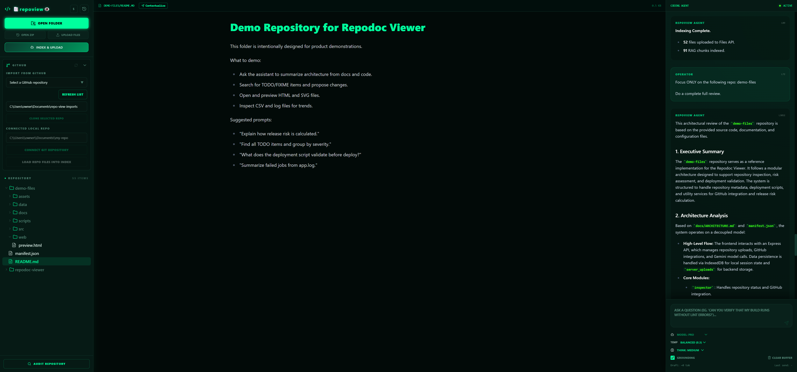
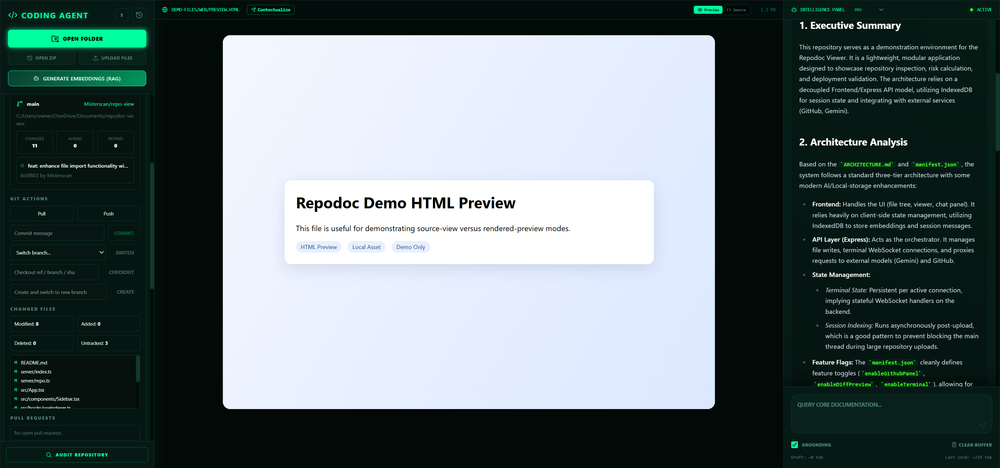
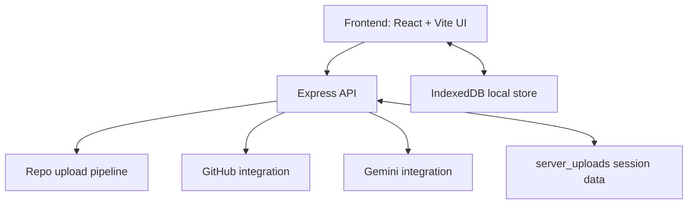
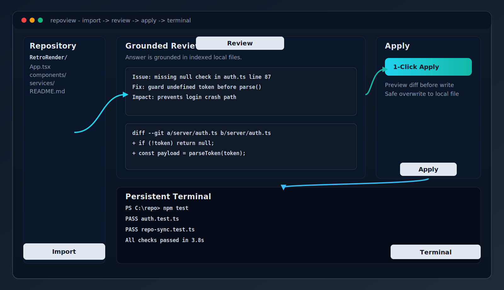

# repoview: Repodoc Viewer and Coding Agent Interface


repoview is a local-first coding workspace for exploring repositories, chatting with indexed code, and applying changes directly from the UI.

It combines a React + Vite frontend with an Express API, IndexedDB-backed local context, optional GitHub inspection tools, and Gemini-powered assistance.

The local API is protected by same-origin or token-based auth and rate-limited by default, with stricter limits on high-impact file and repository mutation endpoints.

## 🚀 Recent Updates (Live)

The application now features a live **Welcome Screen** on startup that pulls the latest changes directly from the [repo-view GitHub](https://github.com/Misterscan/repo-view), showing:
- **Recent Commits:** Author, SHA, and timestamp.
- **File Changes:** A detailed breakdown of which files were modified in each update.

---

## Demo Screenshot



---

## Feature Snapshot

- GitHub inspection panel for branch status, PRs, issues, and Actions runs.
- Persistent terminal over WebSocket for stateful local command execution.
- Repo diff and compare workflows directly in the interface.
- Session indexing with local embeddings and fast repository-aware retrieval.



---

## Architecture Overview





---

## ✨ Key Features

### 🧠 Agentic RAG & Multimodal Intelligence
*   **Intelligent Code Search:** Chat with your codebase using Retrieval-Augmented Generation (RAG).
*   **Web Worker Acceleration:** Embeddings and cosine similarity calculations are processed in the background off the main thread, keeping the UI at 60fps.
*   **Privacy-First Multimodal Support:** Images are tracked locally. When you ask questions about an image, the application fetches the raw binary from local IndexedDB, converts it to Base64, and dynamically injects it into Gemini's context window. Your media assets are **never** synced to persistent cloud storage.
*   **Context Budgeting System:** Automatically prioritizes critical architectural files (like entry points and `package.json`) to prevent context overflow without failing silently.
*   **Live Token Estimation UI:** See your draft prompt size and the full assembled AI context token size directly in the chat interface.

### 💻 Bi-Directional Filesystem Execution
*   **1-Click Apply:** Found a fix in the chat? Hover over the AI-generated code block, preview a diff against the current file, and then apply the overwrite directly to your local disk.
*   **Server-Side Repo Syncing:** Upload project directories as zip payloads. The Node.js backend (`adm-zip`) extracts, hashes files, and provides persistent server-side sessions that keep frontend RAG and backend code generation in sync.
*   **Granular Memory Control:** Manage conversational context turn-by-turn. Hover over any chat message to remove specific turns from the AI context window.
*   **GitHub Integration:** Search your GitHub repositories, clone one directly into a local destination folder with live progress output, then inspect branch state, create or switch branches, commit, pull, push, review changed-file diffs, browse open pull requests and issues, and inspect recent GitHub Actions runs from the sidebar.

### 🖥️ Persistent Shell Session
*   **Stateful WebSocket Shell:** A built-in terminal (powered by `xterm.js` and `pwsh`) that stays alive. Running `.\\venv\\Scripts\\activate.ps1` or setting environment variables will persist for your entire session.
*   **Seamless Integration:** Minimize or maximize the shell directly above your workflow—perfect for testing the code changes you just applied through the UI.

### 📁 Advanced File Visualization
*   **Code Highlights & Markdown:** Dark-themed syntax highlighting for major languages.
*   **Live Preview Matrix:**
    *   **Images & Video:** Native rendering directly within the viewer.
    *   **Interactive HTML Sandbox:** One-click toggle between HTML source code and a live rendered preview iframe.
    *   **PDF Viewer:** Read technical specifications without leaving the environment.
*   **Multi-Repository Sessions:** IndexedDB isolates embeddings, chat logs, and files. Switch contexts instantly between multiple local projects without needing to re-index.

---

## 🛠️ Architecture

*   **Frontend:** React 19, TypeScript, Tailwind CSS, Lucide Icons.
*   **Agent Intelligence:** `@google/genai` (Gemini API 3.0+).
*   **Storage Layer:** `idb` (IndexedDB Wrapper) schema v2 for massive file blobs, embeddings, and chat histories.
*   **Hygiene & Typing:** Full ESLint 9 (Flat Config) & `tsc` strict typescript toolchain (`npm run lint`).
*   **Tooling/Middleware:** Vite Dev Server with custom HTTP REST (`/api/write-file`, `/api/repo/*`) and WebSocket Upgrades (`/api/terminal-ws`).
*   **Server Safeguards:** API-wide request throttling via `express-rate-limit`, with lower per-route ceilings for filesystem writes and repository mutation flows.

---

## 🚀 Quick Start Guide

### The Easiest Ways (Windows Only)
If you are on Windows, you can simply run the included batch scripts. These will automatically detect your package manager, install dependencies if they are missing, start the development server (or production server), and open your browser:
```cmd
.\scripts\dev-ui.bat
```
```cmd
.\scripts\build-start-ui.bat
```
```cmd
.\scripts\start-ui.bat
```

### Manual Setup

#### 1. Prerequisites
Ensure you have **Node.js 20+** installed on your machine and a local installation of **PowerShell** for terminal support.

#### 2. Environment Variables
Create a `.env` file in the root directory and add your Google Gemini API key and (optionally) a development protection token:
 ```env
GEMINI_API_KEY="AIzaSy..."
REPOVIEW_DEV_TOKEN="your-local-dev-token-optional"
GITHUB_TOKEN="your-github-token-optional"
 ```

Notes:
- `GEMINI_API_KEY` is required for the local dev middleware. 
- `REPOVIEW_DEV_TOKEN` is optional protection for local API endpoints.
- `GITHUB_TOKEN` is optional for GitHub integration features.
- **OS Overrides:** If any of these keys exist in your OS environment variables, `dotenvx` will skip them from the `.env` file by default. The `npm run dev` and `npm run start` commands use the `--overload` flag to ensure your `.env` settings always take precedence.
- Local `/api/*` traffic is rate-limited by default. High-impact endpoints such as file writes and repo mutation routes use stricter limits than the general API cap.

#### GitHub Token Setup
If you want to search private repositories, clone/import private repositories, or use the full sidebar GitHub panel, create a GitHub personal access token and place it in `.env` as `GITHUB_TOKEN`.

Recommended setup:
1. Open `GitHub -> Settings -> Developer settings -> Personal access tokens -> Fine-grained tokens`.
2. Generate a new fine-grained token.
3. Choose the owner that contains the repository you want to inspect.
4. Limit access to the specific repository when possible.
5. Grant permissions based on what you want to use:
    - `Contents: Read` for private repository clone/import.
    - `Actions: Read` for GitHub Actions runs.
    - `Pull requests: Read` for open PRs.
    - `Issues: Read` for open issues.
6. Copy the token and add it to `.env`.

Example:
```env
GITHUB_TOKEN="github_pat_..."
```

Notes:
- Fine-grained tokens are preferred over classic tokens.
- If your organization blocks fine-grained tokens, you may need a classic token instead.
- Repository search can succeed with a token that still fails later for clone/import or GitHub panel data if the token does not include the needed repository permissions.
- Clone/import of private repositories requires `Contents: Read`.
- If clone succeeds but the sidebar later shows `GitHub API returned 403`, the token is missing one of the API permissions above, usually `Actions: Read`, `Pull requests: Read`, or `Issues: Read`.
- The same token is also used for the in-app GitHub repository search and clone/import flow.
- Restart the dev server after adding or changing `GITHUB_TOKEN`.

#### 3. Install Dependencies
Install all project dependencies:
```bash
npm install
```
### 3.1 Encrypted API Keys
Run the following command to encrypt your API keys:
```bash
dotenvx encrypt
```

#### 4. Run the Interface
Launch the development server. The UI and local API routes now run through the bundled Express server, with Vite attached in middleware mode during development.

```bash
npm run dev
```

#### 5. Access
Open your browser and navigate to `http://localhost:3000`. 
Upload your project directory to initialize a new RAG session and begin working.

### Production-style Local Run
Build the client bundle and start the Express server serving `dist/`:

```bash
npm run build
npm run start
```

## API Safety Defaults

- All `/api/*` routes are protected by the local auth middleware. Same-origin requests are allowed automatically; cross-origin or scripted access must present the development token.
- All `/api/*` routes are covered by a general rate limiter.
- More sensitive routes, including filesystem operations and repository upload/delete flows, keep stricter per-route limits on top of the general API cap.
- **Log Maintenance:** The server automatically manages its own logs. Every 10 minutes, a background task condenses `logs/server.log` into a summarized format in `logs/summary.log` and then the raw log is purged to save space. You can also run this manually via `npm run logs:summarize`.

---

- If using the free tier of Gemini API, you will be rate-limited to 15 requests per minute. This is to prevent abuse and ensure fair usage. If you need to increase this limit, please upgrade your API key.
- You can check your API usage and limits at https://aistudio.google.com/api-keys
- Google AI Studio provides free API keys for developers to use with their applications with a $300 credit for the first 3 months.
- To claim this:
    1. Go to https://aistudio.google.com/api-keys
    2. Sign in with your Google account
    3. Click on "Create API key"
    4. Copy the API key
    5. Paste it in the .env file as GEMINI_API_KEY
    6. Go to https://cloud.google.com/console/project
    7. Click on "Billing" and link your billing account to the project to enable higher usage tiers.

---


### Dev: External Writes (Approval & Audit)

For safety, external (absolute) writes are disabled by default. Use the following options to opt in or approve specific paths:

- Enable at runtime or persistently: set `ALLOW_EXTERNAL_WRITES=1` in your `.env` or toggle at runtime via the UI Sidebar "External Writes" setting (calls `/api/settings/external-writes`). See the server handler in [server/index.ts](server/index.ts#L1).
- Approve a specific path: POST to `/api/write-approve` with JSON `{ "path": "C:\\absolute\\path\\to\\file", "note": "optional" }` (protected by the dev token). This appends an entry to `logs/external-write-approvals.jsonl`.
- Secret header: set `EXTERNAL_WRITE_SECRET` and include `x-external-write-secret` with write requests to bypass per-path approvals.
- Audit & backups: all overwrites create best-effort backups in `logs/backups` and append an audit entry to `logs/file-writes.log`.

These safeguards are intentional to prevent accidental or malicious overwrites during development. Use them only on trusted machines and avoid enabling in shared CI environments.

### Troubleshooting (PowerShell)

If you see this warning in an embedded terminal:

`Cannot load PSReadline module. Console is running without PSReadLine.`

This warning is usually non-blocking, so you can continue using the app while applying the fix below.

Use a host check in your PowerShell profile so `PSReadLine` only loads in supported hosts:

```powershell
if ($Host.Name -eq "ConsoleHost") {
    Import-Module PSReadLine -ErrorAction SilentlyContinue
}
```

If needed, reinstall the module:

```powershell
Install-Module PSReadLine -Scope CurrentUser -Force -SkipPublisherCheck
```

---

## Testing Demo Files

1. Upload the contents of `demo-files/` to the interface.
2. Use the suggested prompts in `demo-files/README.md` to explore the repository and test features.
3. For diff and compare demos, also upload `demo-files-variant/` and use the suggested compare prompts in `demo-files-variant/README.md`.
4. Compare the two versions by selecting both sessions in the interface to see how the architecture and risk profiles evolved.
5. Use the GitHub panel to inspect the `demo-files` repository status, check for open issues, and view recent workflow runs.

---

## 💡 Workflow Concepts

1. **Index & Understand**: Open a large repo. Let **repoview** index text and media automatically. Use "Full Review" to get a high-level architectural breakdown.
2. **Diagnose & Plan**: Chat with the UI to locate bugs. The model generates code to fix issues based solely on the grounded local context.
3. **Execute & Test**: Click **Apply** on generated code blocks. Open the internal persistent terminal, run your test suite, and iterate.

---

Built with React, Vite, and Google Gemini.
Warning: Bi-directional filesystem writes can make direct local changes. Use with version control.
