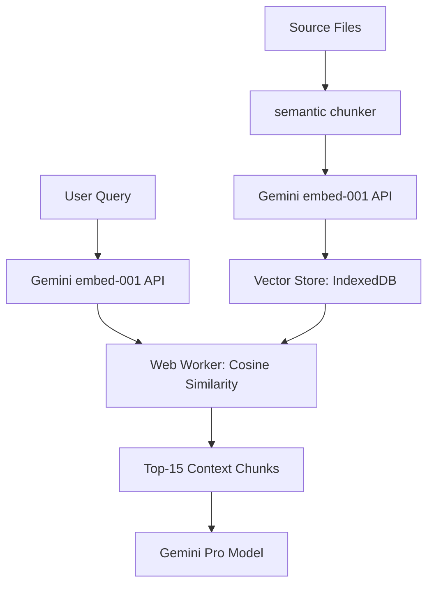

# RAG Engine Architecture

## High-Level Flow

1.  **Ingestion**: Files are read from the `server_uploads/` session directory.
2.  **Chunking**: Large files are split into manageable semantic blocks (default 4,000 characters) to fit within the embedding model's dimensions.
3.  **Embedding**: Each chunk is sent to the Gemini Embedding API (`models/gemini-embedding-001`) to generate a vector representation.
4.  **Storage**: Vectors, along with file paths and metadata, are stored locally in the user's browser using **IndexedDB** (`idb`).
5.  **Retrieval**: When a user asks a question, the query is embedded, and a **cosine similarity** search is performed against the local IndexedDB store.
6.  **Context Assembly**: The most relevant code snippets are assembled into a prompt and sent to Gemini.

## Retrieval Precision & Mathematical Accuracy

The engine uses a deterministic **Cosine Similarity** algorithm to measure the distance between the query vector ($A$) and the document chunk vector ($B$).

$$similarity = \frac{A \cdot B}{\|A\| \|B\|} = \frac{\sum_{i=1}^{n} A_i B_i}{\sqrt{\sum_{i=1}^{n} A_i^2} \sqrt{\sum_{i=1}^{n} B_i^2}}$$

This calculation is performed in the `rag.worker.ts` using a high-performance loop. To maintain accuracy:
- **Normalization**: Similarity scores are bounded between 0 and 1 (since the embedding model outputs normalized vectors).
- **Thresholding**: The system currently defaults to the `topK` (15) most relevant chunks, regardless of absolute score.
- **Context Grounding**: The AI is instructed to ignore information if the retrieval score falls below a certain semantic relevance, ensuring it doesn't "hallucinate" from weak matches.

## Data Integrity
- **Versioned Sessions**: Embeddings are keyed by `sessionId` and a hash of the file content. If a file changes, the engine detects the hash mismatch and re-indexes only the modified segment to maintain 1:1 accuracy with the current disk state.
- **Thread Safety**: By using a dedicated Web Worker, we ensure that the large-scale array mappings and sorting don't cause race conditions or UI state drift during user interaction.

