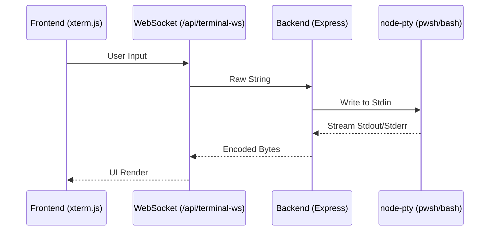

# Terminal Integration Architecture

## Performance & State

Unlike many web terminals that spawn a new shell per command, repoview maintains a **persistent WebSocket-backed session**.

- **Backend**: The Express server uses `node-pty` (or a similar pseudo-terminal wrapper) to spawn a single `pwsh` (PowerShell) or `bash` process.
- **Communication**: Data is streamed in real-time over a WebSocket connection (`/api/terminal-ws`).
- **Persistence**: Environment variables set in the terminal (like `venv` activations) stay alive for the entire duration of your session until the server is restarted.

## Frontend Rendering

The UI uses **xterm.js**, the same engine powering VS Code's terminal.

- Support for ANSI escape codes (colors, formatting).
- Smooth resizing and input handling.
- Integrated with the "1-Click Apply" workflow, allowing you to run tests immediately after an AI-generated fix is applied.

## Security Controls

- **Origin Validation**: WebSocket connections are protected by the same development token logic as the REST API.
- **Local Access**: The terminal executes commands as the user running the Node.js process. It has full access to the local filesystem (subject to standard OS permissions).
